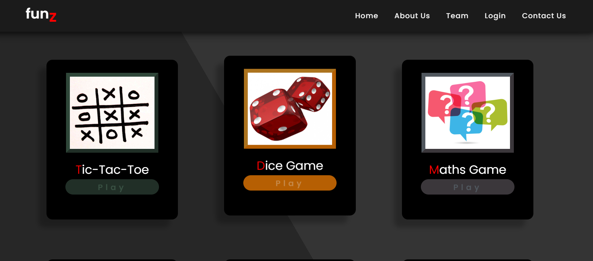
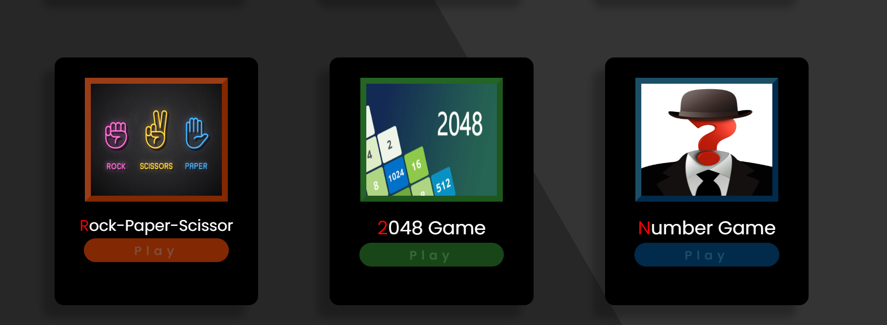

# Funz-games



# Funz Games

Funz Games is a web-based application that features a collection of fun and interactive games including Tic-Tac-Toe, Dice Game, Maths Game, Rock Paper Scissor, 2048 Game, and Guess Number Game. This project is built using HTML, CSS, and JavaScript.

## Table of Contents

- [Features](#features)
- [Games Included](#games-included)
- [Technologies Used](#technologies-used)
- [Installation](#installation)
- [Usage](#usage)
- [Contributing](#contributing)
- [License](#license)

## Features

- A variety of interactive games in one web application.
- User-friendly interface and design.
- Responsive design for mobile and desktop use.

## Games Included

1. **Tic-Tac-Toe**: A classic two-player game.
2. **Dice Game**: A game where players roll dice to achieve the highest score.
3. **Maths Game**: A game to solve math problems.
4. **Rock Paper Scissor**: A classic hand game.
5. **2048 Game**: A sliding block puzzle game.
6. **Guess Number Game**: A game where players guess a randomly generated number.

## Technologies Used

- HTML5
- CSS3
- JavaScript (ES6+)

## Installation

To run this project locally, follow these steps:

1. Clone the repository:

    ```bash
    git clone https://github.com/yourusername/funz_games.git
    ```

2. Navigate to the project directory:

    ```bash
    cd funz_games
    ```

3. Open `index.html` in your preferred web browser.

## Usage

1. Open the application in your web browser.
2. Select a game from the main menu.
3. Follow the game-specific instructions to play and enjoy.

## Contributing

Contributions are welcome! If you would like to contribute to this project, please follow these steps:

1. Fork the repository.
2. Create a new branch for your feature or bugfix:

    ```bash
    git checkout -b feature/your-feature-name
    ```

3. Commit your changes:

    ```bash
    git commit -m 'Add some feature'
    ```

4. Push to the branch:

    ```bash
    git push origin feature/your-feature-name
    ```

5. Open a pull request on GitHub.

## License

This project is licensed under the MIT License. See the [LICENSE](LICENSE) file for details.


[Edit on StackBlitz ⚡️](https://stackblitz.com/edit/web-platform-1h7a4g)
